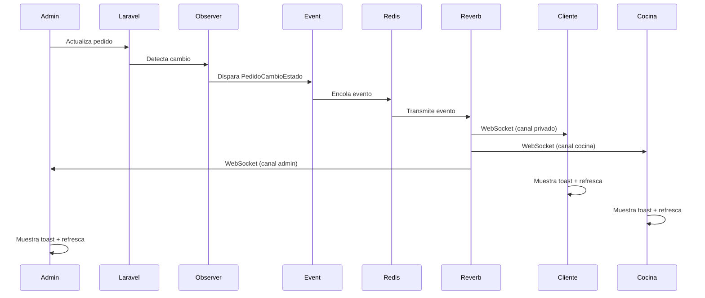

# Sistema de Notificaciones en Tiempo Real

## 📋 Índice

1. [Descripción General](#descripción-general)
2. [Arquitectura del Sistema](#arquitectura-del-sistema)
3. [Stack Tecnológico](#stack-tecnológico)
4. [Componentes Implementados](#componentes-implementados)
5. [Flujo de Funcionamiento](#flujo-de-funcionamiento)
6. [Configuración](#configuración)
7. [Canales de Broadcasting](#canales-de-broadcasting)
8. [Eventos de Broadcasting](#eventos-de-broadcasting)
9. [Integración Frontend](#integración-frontend)
10. [Guía de Pruebas](#guía-de-pruebas)
11. [Troubleshooting](#troubleshooting)

---

## Descripción General

Este documento detalla la implementación completa de un **sistema de notificaciones en tiempo real** para la aplicación de pedidos de comida rápida. El sistema notifica instantáneamente a todos los módulos (Cocina, Admin, Cliente) cuando ocurre cualquier cambio en el ciclo de vida de un pedido.

### Características Principales:

- ✅ **Actualizaciones instantáneas** sin necesidad de polling o recargar la página
- ✅ **Notificaciones toast visuales** para informar cambios
- ✅ **Canales públicos** para módulos internos (Cocina, Admin)
- ✅ **Canales privados** con autorización para clientes
- ✅ **Observer pattern** para despachar eventos automáticamente
- ✅ **Arquitectura escalable** usando WebSockets

---

## Arquitectura del Sistema

```
┌─────────────────────────────────────────────────────────────┐
│                    FLUJO DE EVENTOS                         │
└─────────────────────────────────────────────────────────────┘

1. Usuario realiza acción (crear/actualizar pedido)
                    ↓
2. Laravel actualiza el modelo Pedido
                    ↓
3. PedidoObserver detecta cambio automáticamente
                    ↓
4. Se dispara evento de broadcast (PedidoCreado/PedidoCambioEstado)
                    ↓
5. Redis Queue procesa el evento
                    ↓
6. Laravel Reverb transmite vía WebSocket
                    ↓
7. Laravel Echo (frontend) recibe el evento
                    ↓
8. Componentes Livewire se refrescan automáticamente
                    ↓
9. Aparece notificación toast para el usuario
```

### Diagrama de Componentes:

```
┌──────────────┐      ┌──────────────┐      ┌──────────────┐
│   Frontend   │◄────►│   Reverb     │◄────►│    Redis     │
│ (Echo + JS)  │      │  WebSocket   │      │   Broker     │
└──────────────┘      └──────────────┘      └──────────────┘
                              ▲
                              │
                              │
                    ┌─────────┴─────────┐
                    │   Laravel App     │
                    │   (Observers +    │
                    │    Events)        │
                    └───────────────────┘
```

---

## Stack Tecnológico

### Backend:
- **Laravel 12** - Framework PHP
- **Laravel Broadcasting** - Sistema de broadcasting de eventos
- **Laravel Reverb** - Servidor WebSocket nativo de Laravel
- **Redis 7** - Message broker y cache
- **Model Observers** - Para detectar cambios automáticamente

### Frontend:
- **Laravel Echo 2.2.4** - Cliente WebSocket para JavaScript
- **Pusher.js** - Protocolo de comunicación WebSocket
- **Livewire 3.6** - Framework de componentes reactivos
- **Alpine.js** - Para interactividad del cliente
- **Tailwind CSS 4.0** - Estilos del componente toast

### Infraestructura:
- **Docker Compose** - Orquestación de contenedores
- **Nginx** - Servidor web
- **PHP 8.2-FPM** - Runtime de PHP

---

## Componentes Implementados

### 1. Infraestructura (Fase 1)

#### docker-compose.yml
Servicios agregados:

```yaml
# Servicio Redis para broadcasting
redis:
  image: redis:alpine
  container_name: tesis-redis
  ports:
    - "6379:6379"
  networks:
    - tesis-network

# Servicio Reverb (WebSocket Server)
reverb:
  build:
    context: .
    dockerfile: Dockerfile
  image: tesis-laravel
  container_name: tesis-reverb
  working_dir: /var/www
  command: php artisan reverb:start --host=0.0.0.0 --port=8080
  volumes:
    - ./:/var/www
  ports:
    - "8080:8080"
  depends_on:
    - redis
    - db
  networks:
    - tesis-network
  restart: unless-stopped
```

**Ubicación:** `/docker-compose.yml`

#### config/broadcasting.php
Configuración de broadcasting con driver Reverb:

```php
'default' => env('BROADCAST_CONNECTION', 'null'),

'connections' => [
    'reverb' => [
        'driver' => 'reverb',
        'key' => env('REVERB_APP_KEY'),
        'secret' => env('REVERB_APP_SECRET'),
        'app_id' => env('REVERB_APP_ID'),
        'options' => [
            'host' => env('REVERB_HOST'),
            'port' => env('REVERB_PORT', 443),
            'scheme' => env('REVERB_SCHEME', 'https'),
        ],
    ],
    // ... otros drivers
],
```

**Ubicación:** `/config/broadcasting.php`

#### Variables de Entorno (.env)
```env
BROADCAST_CONNECTION=reverb
REDIS_HOST=redis

REVERB_APP_ID=tesis-app
REVERB_APP_KEY=local-key
REVERB_APP_SECRET=local-secret
REVERB_HOST=0.0.0.0
REVERB_PORT=8080
REVERB_SCHEME=http

VITE_REVERB_APP_KEY="${REVERB_APP_KEY}"
VITE_REVERB_HOST="localhost"
VITE_REVERB_PORT="${REVERB_PORT}"
VITE_REVERB_SCHEME="${REVERB_SCHEME}"
```

---

### 2. Eventos y Observers (Fase 2)

#### PedidoObserver
Observer que detecta cambios en el modelo Pedido y dispara eventos automáticamente:

```php
namespace App\Observers;

use App\Events\PedidoCreado;
use App\Events\PedidoCambioEstado;
use App\Events\PedidoCancelado;
use App\Models\Pedido;

class PedidoObserver
{
    public function created(Pedido $pedido): void
    {
        // Solo disparar evento si el pedido está pagado
        if ($pedido->estado_pago === 'pagado') {
            event(new PedidoCreado($pedido));
        }
    }

    public function updated(Pedido $pedido): void
    {
        // Detectar cambio de estado
        if ($pedido->isDirty('estado')) {
            $estadoAnterior = $pedido->getOriginal('estado');
            $estadoNuevo = $pedido->estado;

            if ($estadoNuevo === 'cancelado') {
                event(new PedidoCancelado($pedido));
            } else {
                event(new PedidoCambioEstado($pedido, $estadoAnterior, $estadoNuevo));
            }
        }

        // Detectar confirmación de pago
        if ($pedido->isDirty('estado_pago') && $pedido->estado_pago === 'pagado') {
            event(new PedidoCreado($pedido));
        }
    }
}
```

**Ubicación:** `/app/Observers/PedidoObserver.php`

**Registro en AppServiceProvider:**
```php
use App\Models\Pedido;
use App\Observers\PedidoObserver;

public function boot(): void
{
    Pedido::observe(PedidoObserver::class);
}
```

**Ubicación:** `/app/Providers/AppServiceProvider.php` (línea 26)

---

### 3. Eventos de Broadcasting

#### PedidoCreado
Evento que se dispara cuando se crea un nuevo pedido con pago confirmado:

```php
namespace App\Events;

use App\Models\Pedido;
use Illuminate\Broadcasting\Channel;
use Illuminate\Broadcasting\InteractsWithSockets;
use Illuminate\Broadcasting\PrivateChannel;
use Illuminate\Contracts\Broadcasting\ShouldBroadcast;
use Illuminate\Foundation\Events\Dispatchable;
use Illuminate\Queue\SerializesModels;

class PedidoCreado implements ShouldBroadcast
{
    use Dispatchable, InteractsWithSockets, SerializesModels;

    public function __construct(public Pedido $pedido) {}

    public function broadcastOn(): array
    {
        return [
            new PrivateChannel('pedidos.' . $this->pedido->id),
            new Channel('cocina'),
            new Channel('admin'),
        ];
    }

    public function broadcastAs(): string
    {
        return 'pedido.creado';
    }

    public function broadcastWith(): array
    {
        return [
            'pedido' => [
                'id' => $this->pedido->id,
                'numero_pedido' => $this->pedido->numero_pedido,
                'estado' => $this->pedido->estado,
                'total' => $this->pedido->total,
                // ... datos completos
            ],
            'mensaje' => "Nuevo pedido {$this->pedido->numero_pedido} recibido",
        ];
    }
}
```

**Ubicación:** `/app/Events/PedidoCreado.php`

#### PedidoCambioEstado
Evento que se dispara cuando cambia el estado de un pedido:

```php
class PedidoCambioEstado implements ShouldBroadcast
{
    public function __construct(
        public Pedido $pedido,
        public string $estadoAnterior,
        public string $estadoNuevo
    ) {}

    public function broadcastOn(): array
    {
        $channels = [
            new PrivateChannel('pedidos.' . $this->pedido->id),
            new Channel('admin'),
        ];

        // Agregar canal cocina si el estado afecta cocina
        if (in_array($this->estadoNuevo, ['en_preparacion', 'listo'])) {
            $channels[] = new Channel('cocina');
        }

        // Agregar canal delivery si el estado afecta delivery
        if (in_array($this->estadoNuevo, ['listo', 'en_camino', 'entregado'])) {
            $channels[] = new Channel('delivery');
        }

        return $channels;
    }

    public function broadcastAs(): string
    {
        return 'pedido.cambio-estado';
    }

    public function broadcastWith(): array
    {
        $mensajes = [
            'en_preparacion' => "Pedido {$this->pedido->numero_pedido} en preparación",
            'listo' => "Pedido {$this->pedido->numero_pedido} está listo",
            'en_camino' => "Pedido {$this->pedido->numero_pedido} en camino",
            'entregado' => "Pedido {$this->pedido->numero_pedido} entregado",
        ];

        return [
            'pedido' => [/* datos */],
            'estado_anterior' => $this->estadoAnterior,
            'estado_nuevo' => $this->estadoNuevo,
            'mensaje' => $mensajes[$this->estadoNuevo] ?? "Estado actualizado",
        ];
    }
}
```

**Ubicación:** `/app/Events/PedidoCambioEstado.php`

#### PedidoCancelado
Evento que se dispara cuando se cancela un pedido:

```php
class PedidoCancelado implements ShouldBroadcast
{
    public function __construct(
        public Pedido $pedido,
        public ?string $motivo = null
    ) {}

    public function broadcastOn(): array
    {
        return [
            new PrivateChannel('pedidos.' . $this->pedido->id),
            new Channel('cocina'),
            new Channel('admin'),
            new Channel('delivery'),
        ];
    }

    public function broadcastAs(): string
    {
        return 'pedido.cancelado';
    }
}
```

**Ubicación:** `/app/Events/PedidoCancelado.php`

---

## Canales de Broadcasting

### Definición de Canales (routes/channels.php)

```php
use Illuminate\Support\Facades\Broadcast;

// Canal privado para clientes - solo el dueño puede acceder
Broadcast::channel('pedidos.{pedidoId}', function ($user, $pedidoId) {
    $pedido = \App\Models\Pedido::find($pedidoId);
    return $pedido && (int) $user->id === (int) $pedido->user_id;
});

// Canal público para módulo cocina
Broadcast::channel('cocina', function ($user) {
    return auth()->check();
});

// Canal público para módulo admin
Broadcast::channel('admin', function ($user) {
    return auth()->check();
});

// Canal público para módulo delivery
Broadcast::channel('delivery', function ($user) {
    return auth()->check();
});
```

**Ubicación:** `/routes/channels.php`

### Tipos de Canales:

| Canal | Tipo | Descripción | Autorización |
|-------|------|-------------|--------------|
| `pedidos.{id}` | Privado | Cliente específico | Solo dueño del pedido |
| `cocina` | Público | Módulo cocina | Usuario autenticado |
| `admin` | Público | Panel administración | Usuario autenticado |
| `delivery` | Público | Módulo delivery | Usuario autenticado |

---

## Integración Frontend

### 1. Configuración de Laravel Echo (bootstrap.js)

```javascript
import Echo from 'laravel-echo';
import Pusher from 'pusher-js';

window.Pusher = Pusher;

window.Echo = new Echo({
    broadcaster: 'reverb',
    key: import.meta.env.VITE_REVERB_APP_KEY,
    wsHost: import.meta.env.VITE_REVERB_HOST,
    wsPort: import.meta.env.VITE_REVERB_PORT ?? 80,
    wssPort: import.meta.env.VITE_REVERB_PORT ?? 443,
    forceTLS: (import.meta.env.VITE_REVERB_SCHEME ?? 'https') === 'https',
    enabledTransports: ['ws', 'wss'],
    disableStats: true,
});
```

**Ubicación:** `/resources/js/bootstrap.js` (líneas 6-21)

### 2. Componente Toast de Notificaciones

```blade
<!-- Toast Notification Container -->
<div id="toast-container" class="fixed top-4 right-4 z-50 space-y-2" style="max-width: 350px;">
    <!-- Los toasts se agregarán dinámicamente aquí -->
</div>

@push('scripts')
<script>
    window.showToast = function(type, message, duration = 5000) {
        const container = document.getElementById('toast-container');
        if (!container) return;

        const config = {
            success: { bg: 'bg-green-500', icon: 'fa-check-circle', text: 'text-white' },
            error: { bg: 'bg-red-500', icon: 'fa-exclamation-circle', text: 'text-white' },
            warning: { bg: 'bg-amber-500', icon: 'fa-exclamation-triangle', text: 'text-white' },
            info: { bg: 'bg-blue-500', icon: 'fa-info-circle', text: 'text-white' }
        };

        const style = config[type] || config.info;
        const toast = document.createElement('div');
        toast.className = `${style.bg} ${style.text} rounded-lg shadow-lg p-4 ...`;
        toast.innerHTML = `
            <div class="flex-shrink-0">
                <i class="fas ${style.icon} text-xl"></i>
            </div>
            <div class="flex-1">
                <p class="text-sm font-medium">${message}</p>
            </div>
            <button onclick="this.parentElement.remove()">
                <i class="fas fa-times"></i>
            </button>
        `;

        container.appendChild(toast);

        // Animar entrada
        setTimeout(() => toast.classList.remove('translate-x-full', 'opacity-0'), 10);

        // Auto-remover
        setTimeout(() => {
            toast.classList.add('translate-x-full', 'opacity-0');
            setTimeout(() => toast.remove(), 300);
        }, duration);
    };
</script>
@endpush
```

**Ubicación:** `/resources/views/components/toast-notification.blade.php`

### 3. Integración en Módulo Cocina

#### Backend (Cocina.php):
```php
protected function getListeners()
{
    return [
        "echo:cocina,.pedido.creado" => '$refresh',
        "echo:cocina,.pedido.cambio-estado" => '$refresh',
        "echo:cocina,.pedido.cancelado" => '$refresh',
    ];
}
```

**Ubicación:** `/app/Livewire/Cocina/Cocina.php` (líneas 26-33)

#### Frontend (cocina.blade.php):
```blade
@push('scripts')
<script>
    if (window.Echo) {
        window.Echo.channel('cocina')
            .listen('.pedido.creado', (e) => {
                console.log('Nuevo pedido creado:', e);
                showToast('success', e.mensaje || 'Nuevo pedido recibido');
            })
            .listen('.pedido.cambio-estado', (e) => {
                console.log('Estado de pedido cambió:', e);
                showToast('info', e.mensaje || 'Estado de pedido actualizado');
            })
            .listen('.pedido.cancelado', (e) => {
                console.log('Pedido cancelado:', e);
                showToast('warning', e.mensaje || 'Pedido cancelado');
            });
    }
</script>
@endpush
```

**Ubicación:** `/resources/views/livewire/cocina/cocina.blade.php` (líneas 306-332)

**Cambios importantes:**
- ❌ Eliminado `wire:poll.30s` (ya no se necesita polling)
- ✅ Componente se actualiza instantáneamente vía WebSocket

### 4. Integración en Módulo Admin

#### Backend (AdminPedidos.php):
```php
protected function getListeners()
{
    return [
        "echo:admin,.pedido.creado" => '$refresh',
        "echo:admin,.pedido.cambio-estado" => '$refresh',
        "echo:admin,.pedido.cancelado" => '$refresh',
    ];
}
```

**Ubicación:** `/app/Livewire/Dashboard/AdminPedidos.php` (líneas 53-60)

#### Frontend (admin-pedidos.blade.php):
```blade
@push('scripts')
<script>
    if (window.Echo) {
        window.Echo.channel('admin')
            .listen('.pedido.creado', (e) => {
                console.log('Admin - Nuevo pedido creado:', e);
                showToast('success', e.mensaje || 'Nuevo pedido recibido');
            })
            .listen('.pedido.cambio-estado', (e) => {
                console.log('Admin - Estado de pedido cambió:', e);
                showToast('info', e.mensaje || 'Estado de pedido actualizado');
            })
            .listen('.pedido.cancelado', (e) => {
                console.log('Admin - Pedido cancelado:', e);
                showToast('warning', e.mensaje || 'Pedido cancelado');
            });
    }
</script>
@endpush
```

**Ubicación:** `/resources/views/livewire/dashboard/admin-pedidos.blade.php` (líneas 296-315)

### 5. Integración en Módulo Cliente

#### Backend (MisPedidos.php):
```php
public function refreshPedidos()
{
    $this->resetPage();
}
```

**Ubicación:** `/app/Livewire/Cliente/MisPedidos.php` (líneas 34-37)

#### Frontend (mis-pedidos.blade.php):
```blade
@push('scripts')
<script>
    // Escuchar actualizaciones de pedidos del usuario actual
    if (window.Echo) {
        @foreach($pedidos as $pedido)
            window.Echo.private('pedidos.{{ $pedido->id }}')
                .listen('.pedido.cambio-estado', (e) => {
                    console.log('Cliente - Estado de mi pedido cambió:', e);
                    showToast('info', e.mensaje || 'Tu pedido ha sido actualizado');
                    @this.call('refreshPedidos');
                });
        @endforeach
    }
</script>
@endpush
```

**Ubicación:** `/resources/views/livewire/cliente/mis-pedidos.blade.php` (líneas 368-382)

**Nota:** Los clientes escuchan canales privados específicos de sus pedidos, con autorización verificada en el backend.

---

## Flujo de Funcionamiento

### Ejemplo: Cambio de Estado de Pedido

```
┌──────────────────────────────────────────────────────────────┐
│  ESCENARIO: Admin cambia estado de "pendiente" a "listo"    │
└──────────────────────────────────────────────────────────────┘

1. Admin hace clic en botón "Marcar como Listo"
   ↓
2. Livewire ejecuta método actualizarEstado()
   ↓
3. $pedido->update(['estado' => 'listo'])
   ↓
4. PedidoObserver detecta isDirty('estado')
   ↓
5. Observer dispara: event(new PedidoCambioEstado($pedido, 'pendiente', 'listo'))
   ↓
6. Laravel Broadcasting procesa el evento
   ↓
7. Evento se envía a Redis
   ↓
8. Reverb lee de Redis y transmite vía WebSocket a:
   - Canal privado: pedidos.{id} (cliente)
   - Canal público: cocina
   - Canal público: admin
   ↓
9. Laravel Echo (frontend) recibe el evento en cada canal
   ↓
10. JavaScript ejecuta callbacks:
    - Cliente: showToast('info', 'Tu pedido está listo')
    - Cocina: showToast('info', 'Pedido #XX está listo')
    - Admin: showToast('info', 'Pedido #XX actualizado')
    ↓
11. Componentes Livewire se refrescan automáticamente ($refresh)
    ↓
12. UI se actualiza en tiempo real mostrando nuevo estado
```

### Diagrama de Secuencia:



---

## Guía de Pruebas

### Prerrequisitos

1. Todos los servicios deben estar corriendo:
```bash
docker-compose ps
```

Deberías ver:
```
tesis-app        Up
tesis-db         Up
tesis-redis      Up
tesis-reverb     Up
tesis-webserver  Up
```

2. Assets compilados:
```bash
make build  # o docker-compose exec app npm run build
```

### Escenarios de Prueba

#### Test 1: Notificación de Nuevo Pedido

**Objetivo:** Verificar que cocina y admin reciben notificación cuando se crea un pedido.

**Pasos:**
1. Abre navegador 1: http://localhost:4000/cocina (Módulo Cocina)
2. Abre navegador 2: http://localhost:4000/pedidos (Panel Admin)
3. Como cliente, crea un nuevo pedido y completa el pago
4. **Resultado esperado:**
   - ✅ Módulo Cocina muestra toast verde: "Nuevo pedido #XXXX recibido"
   - ✅ Panel Admin muestra toast verde: "Nuevo pedido #XXXX recibido"
   - ✅ Ambos componentes se refrescan mostrando el nuevo pedido
   - ✅ Sin necesidad de recargar la página

#### Test 2: Cambio de Estado en Cocina

**Objetivo:** Verificar que cambios en cocina notifican a admin y cliente.

**Pasos:**
1. Abre navegador 1: http://localhost:4000/cocina
2. Abre navegador 2: http://localhost:4000/pedidos
3. Abre navegador 3: http://localhost:4000/cliente/mis-pedidos (como cliente del pedido)
4. En módulo Cocina, haz clic en "Comenzar" en un pedido pendiente
5. **Resultado esperado:**
   - ✅ Cocina: Toast azul "Pedido #XXXX en preparación"
   - ✅ Admin: Toast azul "Pedido #XXXX en preparación"
   - ✅ Cliente: Toast azul "Tu pedido ha sido actualizado"
   - ✅ Todos los módulos refrescan automáticamente

6. En módulo Cocina, haz clic en "Listo"
7. **Resultado esperado:**
   - ✅ Cocina: Toast azul "Pedido #XXXX está listo"
   - ✅ Admin: Toast azul "Pedido #XXXX está listo"
   - ✅ Cliente: Toast azul "Tu pedido está listo"

#### Test 3: Cancelación de Pedido

**Objetivo:** Verificar notificaciones de cancelación.

**Pasos:**
1. Configurar mismos navegadores que Test 2
2. En Panel Admin, selecciona un pedido y haz clic en "Cancelar Pedido"
3. Confirma la cancelación
4. **Resultado esperado:**
   - ✅ Admin: Toast amarillo "Pedido cancelado"
   - ✅ Cocina: Toast amarillo "Pedido cancelado"
   - ✅ Cliente: Toast amarillo "Tu pedido ha sido cancelado"
   - ✅ Pedido desaparece de la lista de cocina
   - ✅ Pedido aparece como cancelado en admin y cliente

#### Test 4: Múltiples Usuarios Simultáneos

**Objetivo:** Verificar que múltiples usuarios reciben notificaciones simultáneamente.

**Pasos:**
1. Abre 3 ventanas de incógnito con módulo cocina
2. Abre 2 ventanas con panel admin
3. Desde cualquier panel, cambia el estado de un pedido
4. **Resultado esperado:**
   - ✅ **Todas las ventanas** reciben la notificación simultáneamente
   - ✅ **Todas las ventanas** refrescan automáticamente
   - ✅ No hay conflictos ni delays perceptibles

### Verificación de WebSocket Connection

#### Ver logs de Reverb:
```bash
make logs-reverb
# o
docker-compose logs -f reverb
```

**Lo que deberías ver:**
```
INFO  Starting server on 0.0.0.0:8080
INFO  Connection established from [IP]
```

#### Ver consola del navegador (F12):
**Al cargar la página:**
```javascript
Echo initialized
Connected to WebSocket server
Listening on channel: cocina
```

**Al recibir evento:**
```javascript
Nuevo pedido creado: {pedido: {...}, mensaje: "Nuevo pedido #1234 recibido"}
```

---

## Troubleshooting

### Problema 1: No se reciben notificaciones

**Síntomas:** Los cambios no aparecen en tiempo real.

**Solución:**
1. Verificar que Reverb esté corriendo:
```bash
docker-compose ps reverb
```

2. Revisar logs de Reverb:
```bash
docker-compose logs reverb --tail=50
```

3. Verificar conexión de WebSocket en consola del navegador (F12):
```javascript
// Debería mostrar:
Echo initialized
Connected to WebSocket server
```

4. Verificar variables de entorno en `.env`:
```env
BROADCAST_CONNECTION=reverb
REDIS_HOST=redis
```

5. Recompilar assets:
```bash
docker-compose exec app npm run build
```

6. Reiniciar servicios:
```bash
docker-compose restart app reverb redis
```

### Problema 2: Observer no dispara eventos

**Síntomas:** Los eventos no se disparan cuando cambia el modelo.

**Solución:**
1. Verificar que el Observer esté registrado en `AppServiceProvider`:
```php
public function boot(): void
{
    Pedido::observe(PedidoObserver::class);
}
```

2. Limpiar cache de configuración:
```bash
docker-compose exec app php artisan config:clear
docker-compose exec app php artisan cache:clear
```

3. Verificar que los cambios se hagan con Eloquent (no con Query Builder):
```php
// ✅ Correcto - dispara observer
$pedido->update(['estado' => 'listo']);

// ❌ Incorrecto - NO dispara observer
DB::table('pedidos')->where('id', $id)->update(['estado' => 'listo']);
```

### Problema 3: Error de autorización en canales privados

**Síntomas:** `Error: Unauthorized` en consola.

**Solución:**
1. Verificar que el usuario esté autenticado
2. Verificar autorización en `routes/channels.php`:
```php
Broadcast::channel('pedidos.{pedidoId}', function ($user, $pedidoId) {
    $pedido = \App\Models\Pedido::find($pedidoId);
    return $pedido && (int) $user->id === (int) $pedido->user_id;
});
```

3. Verificar que el token CSRF esté presente

### Problema 4: Toast no aparece

**Síntomas:** Eventos se reciben pero no se muestran notificaciones.

**Solución:**
1. Verificar que el componente toast esté incluido en el layout:
```blade
<!-- En dashboard-layout.blade.php o layouts/cliente.blade.php -->
<x-toast-notification />
@stack('scripts')
```

2. Verificar que `showToast()` esté definida (revisar consola del navegador):
```javascript
typeof showToast  // debe retornar 'function'
```

3. Verificar z-index del toast (debe ser mayor que otros elementos):
```html
<div id="toast-container" class="... z-50">
```

### Problema 5: Redis connection refused

**Síntomas:** `Connection refused [tcp://redis:6379]`

**Solución:**
1. Verificar que Redis esté corriendo:
```bash
docker-compose ps redis
```

2. Reiniciar Redis:
```bash
docker-compose restart redis
```

3. Verificar configuración en `.env`:
```env
REDIS_HOST=redis
REDIS_PASSWORD=null
REDIS_PORT=6379
```

### Problema 6: Eventos duplicados

**Síntomas:** Las notificaciones aparecen múltiples veces.

**Solución:**
1. Verificar que no haya múltiples listeners registrados
2. Verificar que el Observer no esté registrado dos veces
3. Limpiar listeners de Echo antes de registrar nuevos:
```javascript
// Al inicio del script
window.Echo.leaveAllChannels();
```

### Problema 7: Performance - Demasiadas conexiones

**Síntomas:** El servidor se vuelve lento con muchos usuarios.

**Solución:**
1. Considerar usar canales más específicos en lugar de broadcast a todos
2. Implementar throttling en los eventos
3. Usar `ShouldBroadcastNow` solo para eventos críticos
4. Configurar límites en Reverb (max connections)

---

## Comandos Útiles

### Gestión de Servicios

```bash
# Levantar todos los servicios
make up

# Ver logs de Reverb (WebSocket)
make logs-reverb

# Reiniciar servidor Reverb
make reverb-restart

# Ver estado de Reverb
make reverb-status

# Compilar assets frontend
docker-compose exec app npm run build

# Modo desarrollo (watch)
docker-compose exec app npm run dev

# Reiniciar todos los servicios
docker-compose restart

# Ver logs de todos los servicios
docker-compose logs -f
```

### Debugging

```bash
# Ver logs de Redis
docker-compose logs -f redis

# Entrar al contenedor de app
make shell

# Limpiar cache de Laravel
docker-compose exec app php artisan config:clear
docker-compose exec app php artisan cache:clear
docker-compose exec app php artisan route:clear

# Ver rutas de broadcasting
docker-compose exec app php artisan route:list --name=broadcasting

# Probar conexión a Redis
docker-compose exec app php artisan tinker
>>> Redis::ping()  // debe retornar "PONG"
```

### Testing Manual

```bash
# Disparar evento manualmente desde tinker
docker-compose exec app php artisan tinker
>>> $pedido = \App\Models\Pedido::first();
>>> event(new \App\Events\PedidoCambioEstado($pedido, 'pendiente', 'listo'));

# Verificar que el evento fue procesado
>>> \Illuminate\Support\Facades\Redis::keys('*')
```

---

## Arquitectura de Archivos

```
proyecto/
├── app/
│   ├── Events/
│   │   ├── PedidoCreado.php              # Evento: nuevo pedido
│   │   ├── PedidoCambioEstado.php        # Evento: cambio de estado
│   │   └── PedidoCancelado.php           # Evento: pedido cancelado
│   ├── Observers/
│   │   └── PedidoObserver.php            # Observer para detectar cambios
│   ├── Livewire/
│   │   ├── Cocina/
│   │   │   └── Cocina.php                # Componente cocina (listeners)
│   │   ├── Dashboard/
│   │   │   └── AdminPedidos.php          # Componente admin (listeners)
│   │   └── Cliente/
│   │       └── MisPedidos.php            # Componente cliente
│   └── Providers/
│       └── AppServiceProvider.php        # Registro del Observer
├── config/
│   └── broadcasting.php                  # Configuración de broadcasting
├── routes/
│   └── channels.php                      # Definición de canales
├── resources/
│   ├── js/
│   │   └── bootstrap.js                  # Configuración de Echo
│   └── views/
│       ├── components/
│       │   ├── dashboard-layout.blade.php  # Layout dashboard (+ toast)
│       │   └── toast-notification.blade.php # Componente toast
│       ├── layouts/
│       │   └── cliente.blade.php           # Layout cliente (+ toast)
│       └── livewire/
│           ├── cocina/
│           │   └── cocina.blade.php        # Vista cocina (+ Echo script)
│           ├── dashboard/
│           │   └── admin-pedidos.blade.php # Vista admin (+ Echo script)
│           └── cliente/
│               └── mis-pedidos.blade.php   # Vista cliente (+ Echo script)
├── docker-compose.yml                     # Redis + Reverb services
├── .env                                   # Variables de entorno
├── Makefile                               # Comandos personalizados
└── NOTIFICACIONES_TIEMPO_REAL.md         # Esta documentación
```

---

## Métricas y Monitoreo

### Indicadores de Funcionamiento Correcto

1. **Latencia de notificaciones:** < 500ms desde el cambio hasta la notificación
2. **Tasa de entrega:** 100% de eventos llegan a todos los canales suscritos
3. **Conexiones WebSocket:** Todas las sesiones activas mantienen conexión estable
4. **Logs de Reverb:** No debe mostrar errores de conexión o broadcasting

### Monitoreo Recomendado

```bash
# Ver estadísticas de Redis
docker-compose exec redis redis-cli INFO stats

# Ver conexiones activas en Reverb
docker-compose logs reverb | grep "Connection established"

# Verificar uso de memoria de Redis
docker stats tesis-redis
```

---

## Consideraciones de Producción

### Seguridad

1. **Cambiar credenciales de Reverb:**
```env
REVERB_APP_KEY=tu-clave-segura-aqui
REVERB_APP_SECRET=tu-secreto-seguro-aqui
```

2. **Usar HTTPS/WSS en producción:**
```env
REVERB_SCHEME=https
```

3. **Configurar CORS correctamente** en `config/cors.php`

4. **Validar autorización** en todos los canales privados

### Escalabilidad

1. **Redis clustering:** Para manejar más conexiones
2. **Múltiples instancias de Reverb:** Load balancing de WebSockets
3. **Queue workers:** Procesar eventos en background
4. **Rate limiting:** Limitar broadcast de eventos por usuario

### Backup y Recuperación

1. **Redis persistence:** Configurar RDB o AOF para persistencia
2. **Logs de eventos:** Guardar logs de broadcasting para auditoría
3. **Fallback a polling:** Si WebSocket falla, usar polling como respaldo

---

## Referencias y Recursos

### Documentación Oficial

- [Laravel Broadcasting](https://laravel.com/docs/12.x/broadcasting)
- [Laravel Reverb](https://laravel.com/docs/12.x/reverb)
- [Laravel Echo](https://laravel.com/docs/12.x/broadcasting#client-side-installation)
- [Livewire Events](https://livewire.laravel.com/docs/events)
- [Redis Documentation](https://redis.io/docs/)

### Enlaces Útiles

- [Pusher Protocol](https://pusher.com/docs/channels/library_auth_reference/pusher-websockets-protocol/)
- [WebSocket RFC 6455](https://tools.ietf.org/html/rfc6455)
- [Docker Compose Networking](https://docs.docker.com/compose/networking/)

---

## Changelog

### Versión 1.0.0 - 2025-10-01

**Implementación inicial:**
- ✅ Infraestructura completa (Redis + Reverb)
- ✅ Eventos de broadcasting (PedidoCreado, PedidoCambioEstado, PedidoCancelado)
- ✅ Observer para despacho automático de eventos
- ✅ Integración frontend con Laravel Echo
- ✅ Componente toast de notificaciones
- ✅ Soporte para 3 módulos: Cocina, Admin, Cliente
- ✅ Canales privados con autorización para clientes
- ✅ Canales públicos para módulos internos
- ✅ Documentación completa

---

## Soporte

Para reportar problemas o sugerir mejoras, contacta al equipo de desarrollo o abre un issue en el repositorio del proyecto.

---

**Última actualización:** Octubre 1, 2025
**Versión del documento:** 1.0.0
**Mantenido por:** Equipo de Desarrollo - Combate Mborore
